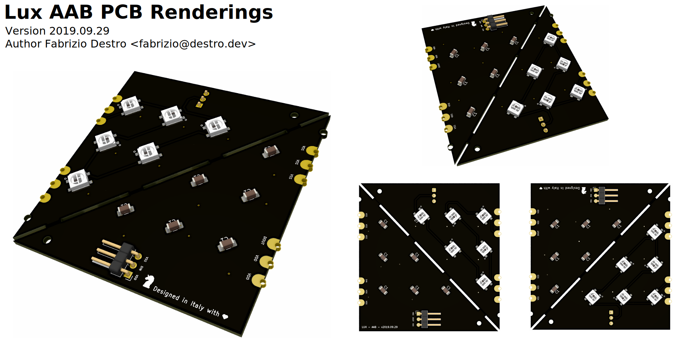
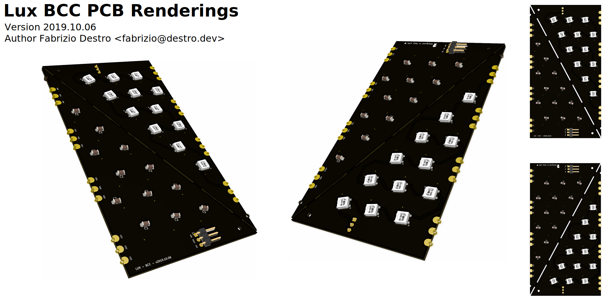

[license]: http://creativecommons.org/licenses/by-nc-sa/4.0/
[license-badge]: https://img.shields.io/badge/License-CC%20BY--NC--SA%204.0-lightgrey.svg?style=for-the-badge

# Lux PCB

[![license badge][license-badge]][license]

## Repository Structure

- [sketches](./sketches): contains the source code of the programs used with
  these boards;
